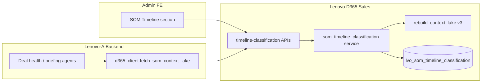

# Sprint 2 · US 3.4.1 — Timeline Classification & Canonical Sales Clock

**Repo:** `Lenovo D365 Sales` (v0.23.0)  
**Depends on:** US 3.2.2 (`sql/2026_11_som_organizational_intent.sql`)  
**Migration:** `sql/2026_12_som_timeline_classification.sql`  
**Postman:** [postman/US_SOM_TIMELINE_CLASSIFICATION.postman_collection.json](./postman/US_SOM_TIMELINE_CLASSIFICATION.postman_collection.json)  
**API contract:** [API_CONTRACT.md](./API_CONTRACT.md) §24  
**Status:** Phase A implemented

---

## Prerequisites

```bash
psql -f sql/2026_10_som_interview_setup.sql
psql -f sql/2026_11_som_organizational_intent.sql
psql -f sql/2026_12_som_timeline_classification.sql
uvicorn app.main:app --reload --port 8000
```

Organizational intent **6/6 CONFIGURED** required before timeline section unlocks.

---

## APIs (implemented)

| Method | Endpoint | Purpose |
|--------|----------|---------|
| GET | `/timeline-classification-section-status` | Section gate + 8/8 progress |
| GET | `/timeline-classification-cards` | Grid of 8 cards |
| GET | `/timeline-classification-cards/{cardType}` | Edit panel + defaults |
| PUT | `/timeline-classification-cards/{cardType}` | Save → Context Lake v3 |
| GET | `/timeline-classification-configuration-status` | 8/8 + `SUCC_MSG_0018` |
| GET | `/context-lake` | v3 adds `timelineClassification` |

**Card types:** `tempo_classes`, `anchor_definitions`, `signal_expectations_time_band`, `seasonal_delayed_activation`, `acceleration_decay`, `multiyear_programmatic`, `exit_recycle_kill`, `canonical_timeline`

---

## Tests

```bash
pytest -q tests/test_som_timeline_classification.py
```

---

## Pending (Phase B+)

- Custom Add Card Category (3.4.1.2.10a)
- AI Concept Assistant API
- Runtime tempo assignment on opportunities

---

## Full specification

See sections below for field keys, errors, Context Lake shape, and caller matrix.

## 1. Purpose

Admins configure **how AI agents interpret deal signals over time**: tempo classes, anchor events, signal expectations per time band, seasonal rules, acceleration/decay, multi-year deals, exit/recycle/kill, and the canonical quarter/year sales clock.

Saved configuration is written to the **Sales Operating Model Context Lake (v3)** so Lenovo-AIBackend agents (deal health, briefing, recommendations) read one snapshot — same pattern as organizational intent (US 3.2.2).

---

## 2. Who calls which API

| Caller | Role | APIs used | Why |
|--------|------|-----------|-----|
| **Admin FE** (`Admin > Sales Operating Model`) | Primary | All `timeline-classification-*` endpoints below | Render section, edit cards, save/cancel, show badges & toasts |
| **Admin FE** | Gate | `GET /configuration-status` (3.2.2) + `GET /timeline-classification-section-status` | Hide or disable section until org intent is 6/6 |
| **Lenovo-AIBackend** | Consumer | `GET /api/sales-operating-model/context-lake` (v3) | Deal-health / recommendation agents load `timelineClassification` block |
| **Lenovo-AIBackend** | Optional direct | `GET /timeline-classification-cards` | Debug / smoke only — prefer Context Lake in production |
| **D365 internal jobs** | Future | Context Lake only | Batch tempo-class assignment on opportunities |
| **Postman / QA** | Test | Full collection | Regression before FE integration |

**Not called by:** Seller UI, Opportunities grid, meeting bot — this is **admin policy**, not seller runtime.

**FE-only (no API):** Cancel on edit panel, INFO_MSG_0006 confirmation dialog UI, AI Concept Assistant panel (Phase C — separate AI service).

---

## 3. Architecture



**Save path:** `PUT` card → validate fields → guardrail cross-check vs `constraint` intent → persist JSONB → `rebuild_context_lake()` → return card + section status.

---

## 4. Prerequisites & section access

### 4.1 Organizational intent gate (AC)

Section **Timeline classification and canonical sales clock** is available only when US 3.2.2 is complete.

| Check | API | Pass condition |
|-------|-----|----------------|
| Org intent complete | `GET /api/sales-operating-model/configuration-status` | `allConfigured === true` (6/6) |

### 4.2 Timeline section status (new)

```
GET /api/sales-operating-model/timeline-classification-section-status
```

**200 (unlocked):**
```json
{
  "sectionUnlocked": true,
  "organizationalIntentConfigured": true,
  "timelineConfiguredCount": 3,
  "timelineTotalCount": 8,
  "allTimelineConfigured": false,
  "successCode": null
}
```

**200 (locked — org intent incomplete):**
```json
{
  "sectionUnlocked": false,
  "organizationalIntentConfigured": false,
  "timelineConfiguredCount": 0,
  "timelineTotalCount": 8,
  "allTimelineConfigured": false,
  "messageCode": "INF_MSG_0005"
}
```

FE: do not render the 8-card grid when `sectionUnlocked === false`. Show link/message to complete Organizational Intent first.

---

## 5. API summary

Base path: `/api/sales-operating-model`

| # | Method | Endpoint | Caller | Purpose |
|---|--------|----------|--------|---------|
| 1 | GET | `/timeline-classification-section-status` | Admin FE | Section gate + 8/8 progress |
| 2 | GET | `/timeline-classification-cards` | Admin FE | Two-column grid: 8 cards, status, preview |
| 3 | GET | `/timeline-classification-cards/{cardType}` | Admin FE | Edit panel: full `fields`, labels, defaults |
| 4 | PUT | `/timeline-classification-cards/{cardType}` | Admin FE | Save card → Context Lake v3 |
| 5 | GET | `/timeline-classification-configuration-status` | Admin FE | 8/8 check + `SUCC_MSG_0018` |
| 6 | GET | `/context-lake` | AI team | **v3** — adds `timelineClassification` |

**Phase B (deferred):** `POST /timeline-classification-cards` (custom category), `DELETE /timeline-classification-cards/{cardType}` (clear card), AI Concept Assistant chat API.

---

## 6. Card types (`cardType` path param)

Eight **fixed** seeded cards (slug → display name):

| `cardType` | UI heading | Notes |
|------------|------------|-------|
| `tempo_classes` | Tempo classes | Multi-entry classes + default assignment rule |
| `anchor_definitions` | Anchor definitions | Per-class anchors, pause events, re-anchor policy |
| `signal_expectations_time_band` | Signal expectations by time band | 0–30d / 30–90d / 90–180d bands + minimum alive evidence |
| `seasonal_delayed_activation` | Seasonal and delayed activation | Activation windows, fiscal rules, escalation |
| `acceleration_decay` | Acceleration and decay | Markers, decay signals, per-class day thresholds |
| `multiyear_programmatic` | Multi-year and programmatic deals | Lifecycle units, checkpoints, phased success |
| `exit_recycle_kill` | Exit, recycle, and kill | Pause/recycle/close conditions, authority, cadence |
| `canonical_timeline` | Canonical (quarter/yearly) timeline | Week bands 1–4 / 5–8 / 9–12 + Q1–Q4 yearly |

---

## 7. Endpoint detail

### 7.1 `GET /timeline-classification-cards`

**Caller:** Admin FE on section load.

**200:**
```json
{
  "sectionLabel": "Time-aware expectations",
  "items": [
    {
      "cardType": "tempo_classes",
      "displayName": "Tempo classes",
      "status": "NOT_CONFIGURED",
      "statusBadge": "NOT_CONFIGURED",
      "lastSyncedAt": null,
      "fieldPreview": {}
    }
  ]
}
```

- `status`: `CONFIGURED` | `NOT_CONFIGURED` (FE maps `CONFIGURED` → **ACTIVE** badge per story).
- `fieldPreview`: short strings for grid subtitles (first class name, first anchor, etc.).

---

### 7.2 `GET /timeline-classification-cards/{cardType}`

**Caller:** Admin FE when user clicks **Edit / Configure**.

**200:**
```json
{
  "cardType": "tempo_classes",
  "displayName": "Tempo classes",
  "status": "NOT_CONFIGURED",
  "lastSyncedAt": null,
  "fields": { },
  "fieldLabels": { "classesDeclared": "Classes declared", ... },
  "defaults": { "classesDeclared": [ ... ] },
  "requiredFields": ["classesDeclared", "defaultTempoClassRule"]
}
```

- If `NOT_CONFIGURED`: `fields` merges **seed defaults** (story pre-population) so admin sees editable defaults, not blank chaos.
- If `CONFIGURED`: `fields` = saved JSONB only.

---

### 7.3 `PUT /timeline-classification-cards/{cardType}`

**Caller:** Admin FE after user confirms INFO_MSG_0006 in the UI.

**Headers:** `X-User-Id` optional (audit / `configuredBy`).

**Body:**
```json
{
  "fields": { },
  "confirmAgentImpact": true
}
```

| Field | Required | Notes |
|-------|----------|-------|
| `fields` | yes | Card-specific keys (§8) |
| `confirmAgentImpact` | yes | Must be `true` or save rejected (see 7.3.1) |

**200:**
```json
{
  "cardType": "tempo_classes",
  "displayName": "Tempo classes",
  "status": "CONFIGURED",
  "lastSyncedAt": "2026-06-19T14:30:00Z",
  "allConfigured": false,
  "successCode": null
}
```

When 8/8 configured: `allConfigured: true`, `successCode: "SUCC_MSG_0018"`.

#### 7.3.1 Agent impact confirmation (INFO_MSG_0006)

| `confirmAgentImpact` | HTTP | Response |
|----------------------|------|----------|
| `false` or omitted | **428** | `{ "code": "INFO_MSG_0006", "message": "This change will update agent behaviour from the next recommendation cycle..." }` |
| `true` | proceed | Normal save |

FE flow: user clicks Save → if 428, show modal → on Confirm, retry PUT with `confirmAgentImpact: true`.

#### 7.3.2 Validation errors

| Code | HTTP | When |
|------|------|------|
| `ERR_MSG_0028` | 422 | Required field empty — `{ "code", "field", "message" }` |
| `ERR_MSG_0025` | 422 | Decay review threshold ≤ 0 (timeline context) |
| `ERR_MSG_0026` | 422 | Evidence note cadence ≤ 0 |
| `ERR_MSG_0027` | 422 | Value conflicts with **Constraint** organizational intent guardrail |
| `ERR_MSG_0029` | 500 | Transaction failed; no partial commit |
| `ERR_MSG_0030` | 403 | Section locked — org intent not 6/6 |

> **Note:** `ERR_MSG_0025` is also used by AIBackend briefing generation failures. FE must use **route context** for user-facing copy (same pattern as 0022–0024 on org intent).

#### 7.3.3 Hard guardrail check (ERR_MSG_0027)

Before agent-impact confirmation, backend compares timeline fields marked `isGuardrailCrossCheck: true` against saved `organizationalIntents.constraint.fields` (margin floors, compliance gates). Example: a timeline “minimum margin during decay review” cannot fall below constraint `marginFloors`.

---

### 7.4 `GET /timeline-classification-configuration-status`

**Caller:** Admin FE banner after saves / on section load.

**200:**
```json
{
  "allConfigured": true,
  "configuredCount": 8,
  "totalCount": 8,
  "successCode": "SUCC_MSG_0018"
}
```

---

### 7.5 `GET /context-lake` (v3 extension)

**Caller:** Lenovo-AIBackend `fetch_som_context_lake()`.

**200 shape (additive):**
```json
{
  "version": 3,
  "cycleId": "...",
  "updatedAt": "...",
  "interview": { "roles": {} },
  "organizationalIntents": {},
  "timelineClassification": {
    "tempo_classes": {
      "displayName": "Tempo classes",
      "status": "CONFIGURED",
      "lastSyncedAt": "...",
      "fields": {}
    }
  }
}
```

Only `CONFIGURED` cards appear under `timelineClassification` (same rule as organizational intents).

**AI consumption rules:**
1. Apply **organizational intents** first (especially `constraint` guardrails).
2. Classify deal **tempo** using `tempo_classes`; fallback = `defaultTempoClassRule`.
3. Start/pause **sales clock** from `anchor_definitions` by tempo class.
4. Evaluate **signal expectations** per deal age band; flag silence beyond thresholds.
5. Suppress seasonal false risks per `seasonal_delayed_activation`.
6. Adjust health on **acceleration_decay** markers/thresholds.
7. Long-cycle rules from **multiyear_programmatic**.
8. Route pause/recycle/close per **exit_recycle_kill** + evidence cadence.
9. Interpret seller KPI signals via **canonical_timeline** week + quarter bands.

---

## 8. Field keys per card (`PUT` body `fields`)

### 8.1 `tempo_classes`

| Key | Type | Required | Default (seed) |
|-----|------|----------|----------------|
| `classesDeclared` | array of `{ className, scopeDefinition }` | yes | Fast/Transactional, Quarterly/Enterprise, Programmatic/Annual, Strategic/Multiyear (see story) |
| `defaultTempoClassRule` | string | yes | `Quarterly/Enterprise; exceptions = Strategic and Programmatic` |

### 8.2 `anchor_definitions`

| Key | Type | Required |
|-----|------|----------|
| `fastClassAnchor` | string | yes |
| `enterpriseAnchor` | string | yes |
| `programmaticAnchor` | string | yes |
| `strategicAnchor` | string | yes |
| `reAnchorPolicy` | string | yes |
| `clockPauseEvents` | string[] | yes |
| `noAnchorStateRule` | string | yes |
| `customFields` | array of `{ key, label, value }` | no |

Defaults per story (first customer meeting, architecture validation, RFP issuance, steering committee sign-off, etc.).

### 8.3 `signal_expectations_time_band`

| Key | Type | Required |
|-----|------|----------|
| `band0to30` | `{ expectedSignals, acceptableSilenceDays }` | yes |
| `band30to90` | `{ expectedSignals, flatPeriodException }` | yes |
| `band90to180` | `{ expectedSignals, strategicClassException }` | yes |
| `minimumAliveEvidenceRule` | string | yes |
| `customFields` | array | no |

`acceptableSilenceDays` is integer (default 10 for 0–30d band).

### 8.4 `seasonal_delayed_activation`

| Key | Type | Required |
|-----|------|----------|
| `activationWindows` | array of `{ quarterLabel, description }` | yes |
| `fiscalYearEndLowActivityRule` | string | yes |
| `preActivationActivityClassification` | string | yes |
| `noActivationEscalationRule` | string | yes |
| `authorityRules` | string | no |
| `evidenceNoteCadenceDays` | integer | no — if present must be > 0 (`ERR_MSG_0026`) |
| `customFields` | array | no |

### 8.5 `acceleration_decay`

| Key | Type | Required |
|-----|------|----------|
| `accelerationMarkers` | string[] | yes |
| `decaySignals` | string[] | yes |
| `decayReviewThresholds` | `{ fastDays, enterpriseDays, strategicDays }` | yes — each > 0 (`ERR_MSG_0025`) |
| `extendedToleranceRule` | string | yes |
| `customFields` | array | no |

Defaults: Fast 30d, Enterprise 45d, Strategic 75d.

### 8.6 `multiyear_programmatic`

| Key | Type | Required |
|-----|------|----------|
| `programmaticLifecycleUnit` | string | yes |
| `strategicLifecycleUnit` | string | yes |
| `formalCheckpoints` | string[] | yes |
| `strategicAliveEvidence` | string | yes |
| `phasedSuccessRule` | string | yes |
| `customFields` | array | no |

### 8.7 `exit_recycle_kill`

| Key | Type | Required |
|-----|------|----------|
| `pauseCondition` | string | yes |
| `recycleToNurtureCondition` | string | yes |
| `closeNoDealCondition` | string | yes |
| `authorityRule` | `{ proposeRole, approveRole, recommendRole }` | yes |
| `evidenceNoteCadenceDays` | integer | yes — > 0 (`ERR_MSG_0026`) |

Defaults: Seller / Manager / System for authority roles; cadence 14 days.

### 8.8 `canonical_timeline`

**Weekly**

| Key | Type | Required |
|-----|------|----------|
| `week1to4` | `{ dominantActivity, kpiTarget, agentInterpretationNote }` | yes |
| `week5to8` | same | yes |
| `week9to12` | same | yes |
| `globalAgentInterpretationRule` | string | yes |

**Yearly**

| Key | Type | Required |
|-----|------|----------|
| `q1` | `{ quarterCharacter, annualKpiContribution, agentInterpretationNote }` | yes |
| `q2` | same | yes |
| `q3` | same | yes |
| `q4` | same | yes |
| `crossQuarterCarryoverRule` | string | yes |
| `globalYearlyInterpretationRule` | string | yes |

---

## 9. User scenarios → API mapping

| Scenario | FE action | API |
|----------|-----------|-----|
| 3.4.1.2.1 Open section | Load grid | GET cards + section-status |
| 3.4.1.2.2–2.9 Configure card | Open panel | GET `{cardType}` |
| Save card | Confirm INFO_MSG_0006 → PUT | PUT with `confirmAgentImpact: true` |
| 3.4.1.2.10 Agent impact warning | Modal | Handle 428 → retry |
| 3.4.1.2.10(a) Add category | **Phase B** | POST custom card |
| 3.4.1.2.11 Guardrail violation | Inline error | 422 `ERR_MSG_0027` |
| 3.4.1.2.12 Cancel | Discard local state | **No API** |
| 3.4.1.2.13 Required field | Inline error | 422 `ERR_MSG_0028` |
| 3.4.1.2.14 System error | Toast + stay in edit | 500 `ERR_MSG_0029` |
| 3.4.1.2.15 All configured | Banner | `SUCC_MSG_0018` on status endpoint |

---

## 10. Implementation phases (backend)

| Phase | Scope | Deliverables |
|-------|--------|--------------|
| **A** | Fixed 8 cards CRUD + validation + Context Lake v3 | SQL migration, model, `som_timeline_classification.py`, router routes, tests, Postman |
| **B** | Custom card category (3.4.1.2.10a) | `is_custom` column, POST/DELETE, dynamic field schema |
| **C** | AI Concept Assistant | AIBackend chat endpoint — out of D365 scope |
| **D** | Runtime tempo assignment on opportunities | Batch/job using `tempo_classes` — future |

---

## 11. Database (planned)

```sql
-- lvo_som_timeline_classification
--   lvo_cardtype VARCHAR(64) PK  (8 fixed CHECK values + custom in Phase B)
--   lvo_displayname, lvo_status, lvo_fields JSONB
--   lvo_last_synced_at, lvo_configured_by, lvo_cycleid FK
```

Seed 8 rows `NOT_CONFIGURED` with default `lvo_fields` template JSON for GET pre-population.

---

## 12. Tests (planned)

```bash
pytest -q tests/test_som_timeline_classification.py
```

Cases: section locked when org intent 0/6, save without `confirmAgentImpact`, decay threshold 0 → 0025, cadence 0 → 0026, guardrail conflict → 0027, 8/8 → 0018, Context Lake v3 contains configured cards only.

---

## 13. Related docs

- [SPRINT_2_US322_SOM_ORGANIZATIONAL_INTENT_BACKEND_HANDOFF.md](./SPRINT_2_US322_SOM_ORGANIZATIONAL_INTENT_BACKEND_HANDOFF.md) — prerequisite
- [API_CONTRACT.md](./API_CONTRACT.md) §24
- Lenovo-AIBackend: extend `fetch_som_context_lake()` for `version >= 3`

---

## 14. Message codes (timeline context)

| Code | When |
|------|------|
| `INFO_MSG_0006` | Agent impact — confirm before save (428) |
| `SUCC_MSG_0018` | All 8 timeline cards configured |
| `ERR_MSG_0025` | Decay threshold not positive (days) |
| `ERR_MSG_0026` | Evidence note cadence not positive (days) |
| `ERR_MSG_0027` | Hard guardrail conflict with Constraint intent |
| `ERR_MSG_0028` | Required field missing |
| `ERR_MSG_0029` | Save transaction failed |
| `ERR_MSG_0030` | Section locked — complete org intent first |
